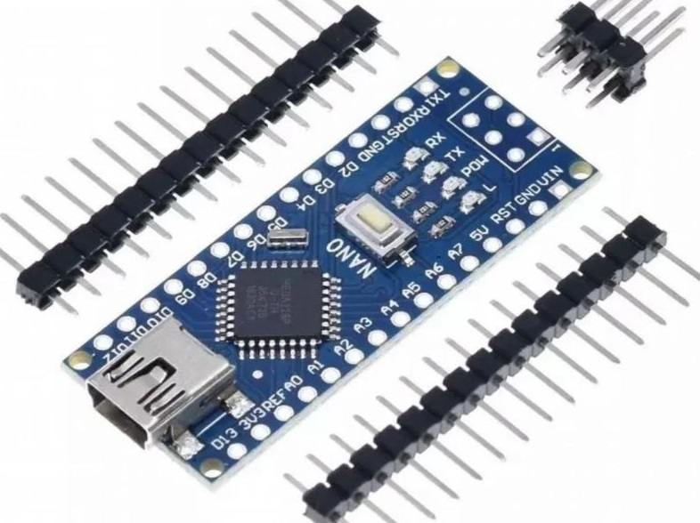
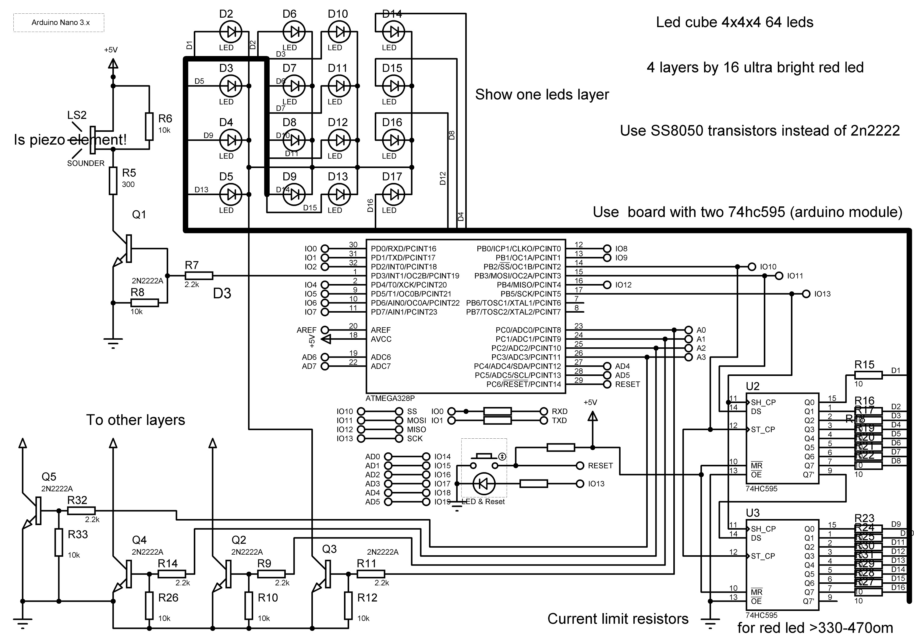
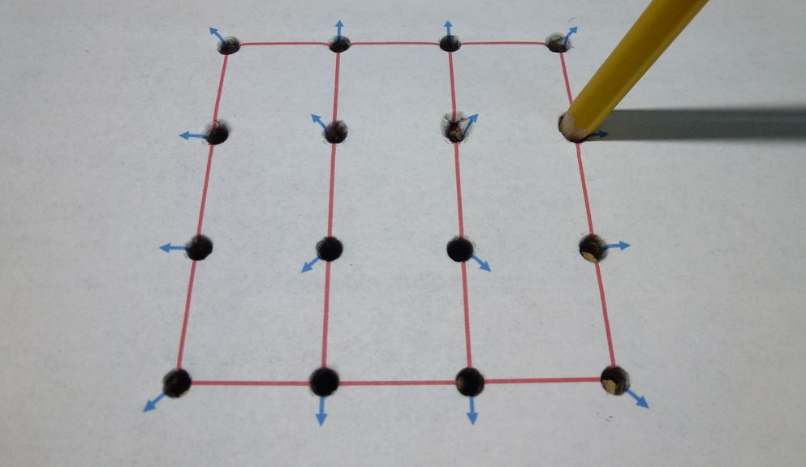
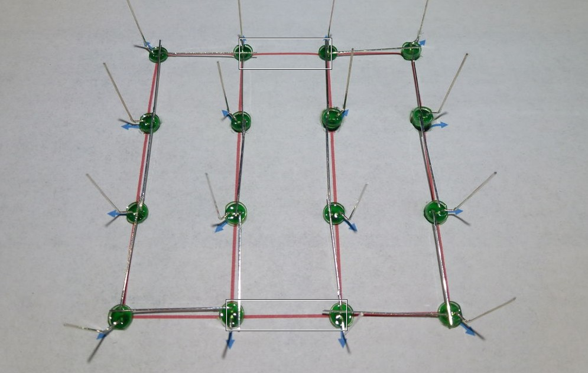
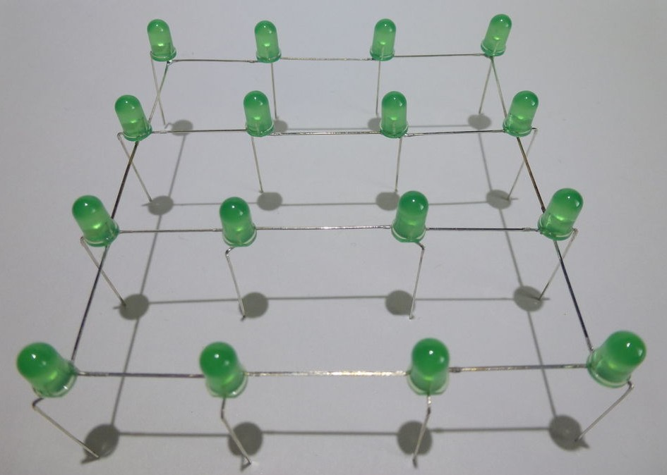
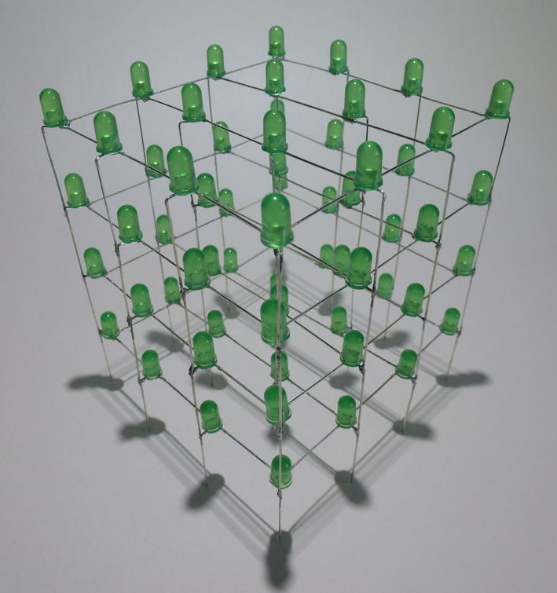

<h2 align="center">Led Cube 4x4x4</h2>

Вашему вниманию представлен проект светодиодного куба из 64 светодиодов на arduino nano v3. 

Куб воспроизводит 4 эффекта и играет мелодию “В лесу родилась ёлочка”.

Куб был собран в 2019 году в качестве новогоднего подарка. Фотографий собранного устройства не осталось.

На рисунке показана схема куба:

В оригинальной конструкции использовались транзисторы SS8050. На схеме указаны 2n2222, так как в симуляторе нужных не оказалось.

Куб состоит из 4-х вертикальных слоев. Каждый слой включается отдельным транзистором. Cветодиодом (всего 16) в слое управляет сдвиговый регистр 74hc595 (экономит ноги микроконтроллера, и защищает его от короткого замыкания в выходных цепях). Регистра 2, так как 16 светодиодов, при желание — количество можно увеличить.

Микроконтроллер работает от кварцевого (или керамического) резонатора установленного на плате arduino nano, с частотой 16мгц.

В основе кода реализован подход переключения потоков (в терминах операционной системы). Т.е. пока аппаратный блок начинает играть мелодию, вызываем функцию, выполняющую все действия, связанные с эффектом. Как только она отработает – возвращаемся обратно и отключаем мелодию.

16 битный таймер-счетчик используется для переключения эффектов. Длина мелодии – 28 нот.

Куб собран из 64 красных 3мм ультра-ярких светодиодов. Светодиоды выбраны с прозрачным корпусом. Весь куб вмещается на ладонь.
Низ светодиодной матрицы припаян к макетной плате, на ней распаяны регистры, транзисторы и Arduino.

На рисунке показан процесс сборки другого куба(общий анод у слоя!). В нашей схеме у слоя - общий катод.

Для сборки используется бумажный шаблон, который можно сделать в программе Sprint-Layout. Запускаете программу – создаете требуемую сетку, ставите точки. Печатаете.

Вставляем светодиоды и спаиваем слой.

Размер прошивки 4544 байт(14% от общего объема памяти микроконтроллера). 
Cреда разработки Arduino Ide.

Содержание репозитория: 
<strong>ArduinoSource</strong> - исходный код и сама прошивка; 
<strong>Proteus\LedCubeProteus</strong> - полная модель всего проекта с одним слоем(тормозит звук при запуске симуляции); 
<strong>Proteus\SoundTest</strong> - модель только с динамиком, для тестирования звука;

Файлы подходят для Proteus 8 Professional 8.8 SP1 (Build 27031) with Advanced Simulation.

